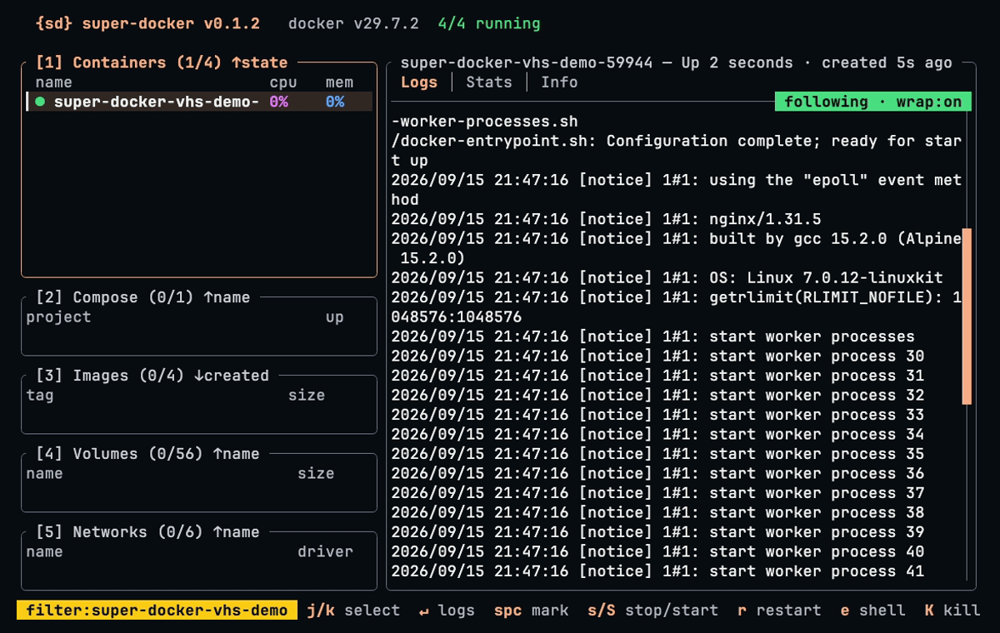

# super-docker

A fast, keyboard-first terminal UI for Docker containers, Compose projects,
images, volumes, and networks.



## Install

Requirements:

- A running Docker daemon
- Rust 1.85 or newer
- The Docker Compose plugin for Compose actions such as `up` and `build`

Install directly from GitHub:

```sh
cargo install --git https://github.com/preacherxp/super-docker super-docker
sd
```

Or build from a local checkout:

```sh
git clone https://github.com/preacherxp/super-docker.git
cd super-docker
cargo install --path .
sd
```

Both `sd` and `super-docker` launch the same application. Press `?` for the
complete key map and `q` to quit.

Useful options:

```sh
sd --no-update-check  # disable the release check for this run
sd --history          # print recent Docker mutation history
sd --version          # print the installed version
```

Set `DOCKER_HOST` to use a non-default Unix or TCP daemon. Update checks can be
disabled globally with `SUPER_DOCKER_NO_UPDATE_CHECK=1`, and operation-history
storage can be overridden with `SUPER_DOCKER_DB=/path/to/history.sqlite3`.

## Implementation

`super-docker` talks directly to the Docker Engine HTTP API over Unix or TCP
sockets. It uses plain Rust threads, bounded channels, cancellable streams, and
event-driven targeted refreshes; the Docker CLI is reserved for Compose
mutations and interactive `docker exec`.
