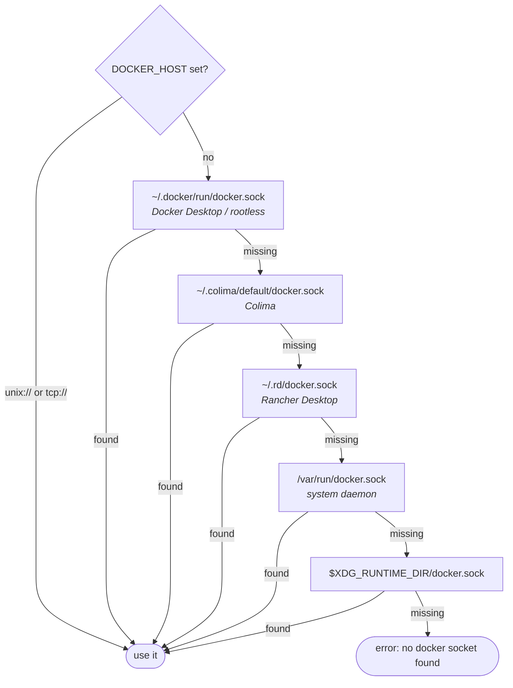
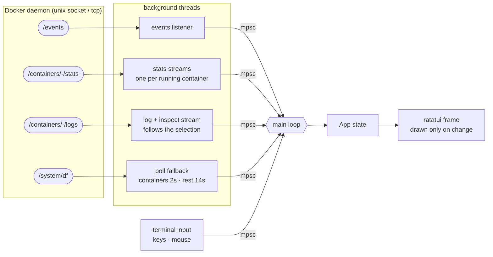
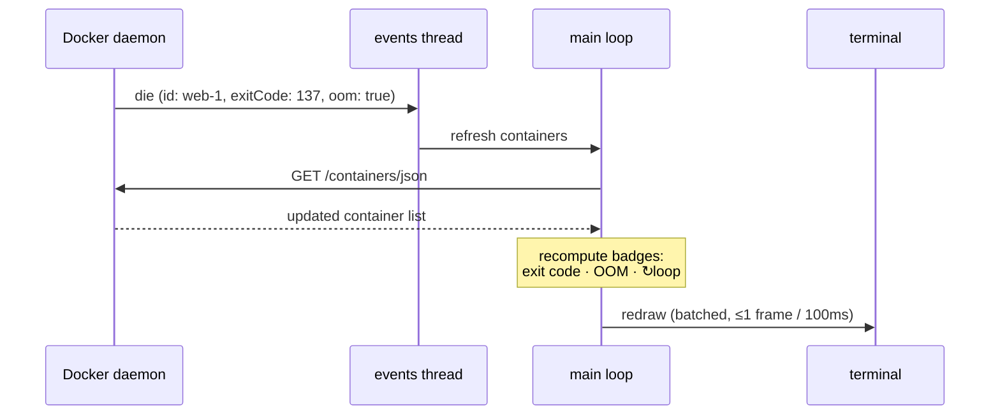

# ⚡ super-docker

> A fast, event-driven terminal UI for Docker — containers, compose projects,
> images, volumes and networks in one keyboard-first dashboard.

Written in Rust with exactly **two dependencies**: [ratatui](https://ratatui.rs)
and [crossterm](https://crates.io/crates/crossterm). No tokio, no bollard, no
serde — it speaks HTTP/1.1 to the Docker socket with its own tiny client and
JSON parser. It subscribes to the Docker **events stream** and refreshes only
what changed, so there are no polling storms and no `docker` CLI shelling for
data.

```
┌ [1] Containers (7) ──────────┐┌ web-1 — Up 2 hours · created 2h ago ─────────┐
│ ● web-1          2%   1%     ││ Logs │ Stats │ Info                          │
│ ● db-1           0%   4%     ││ 10:02:11 GET /health 200                     │
│ ○ worker-1       -    -      ││ 10:02:14 GET /api/items 200                  │
├ [2] Compose (2) ─────────────┤│ 10:02:15 POST /api/items 201                 │
│ ● shop           3/3         ││ ...                                          │
│ ◐ analytics      1/2         ││                                    following │
├ [3] Images (12) ─────────────┤└──────────────────────────────────────────────┘
```

## Features

- **Five live panels, accordion layout** — Containers, Compose projects, Images,
  Volumes, Networks, all updating in real time via the Docker events stream;
  the active panel expands, the rest collapse to a title line, and `z` zooms
  any pane to full screen
- **Docker Compose support** — projects auto-grouped from `com.docker.compose.*`
  labels (pure API), per-service status table, aggregated logs prefixed by
  service, and `up -d` / `stop` / `restart` / `build` / `down` actions
- **Streaming logs** — wrapped long lines, follow mode, 5k-line scrollback,
  keyboard and mouse-wheel scrolling, log-level coloring (error / warn / debug)
- **Live stats** — CPU + memory gauges with sparkline history (120 samples),
  network I/O, pid count; computed the same way `docker stats` does
  (page cache subtracted from memory usage)
- **Diagnostics at a glance** — dead containers show their exit code in red,
  OOM-killed ones get an `OOM` badge, restart loops (3+ deaths in 5 min) get
  `↻loop`, failing healthchecks a red `✚`; the Info tab adds the failing
  streak and the last probe outputs
- **Events overlay** — `E` shows the last 500 daemon events (start / die /
  oom / health…) with relative timestamps, so "why did it restart" has an
  answer
- **Inspect view** — status, health, command, restart policy, per-network IPs,
  mounts, environment (env values masked by default, `x` reveals them)
- **Related containers everywhere** — the detail pane for an image, volume or
  network lists the containers using / mounting / attached to it
- **Volume sizes** — real disk usage per volume from the `system/df` endpoint
- **Batch actions** — mark rows with `space` (or `A` for all), remove everything
  marked in one confirm; `D` wipes all listed containers / images / volumes /
  networks at once (respects the active filter, requires an explicit `y`)
- **One-key shell** — `e` drops you into `bash`/`sh` inside the selected
  container and returns to the TUI when you exit
- **Quick-win keys** — `y` yanks the row's name (`Y` its id) to the clipboard
  via OSC 52, so it works over ssh and inside tmux with no clipboard tool;
  `o` opens the container's first published port as `localhost:PORT` in the
  browser; `K` kills with a chosen signal (TERM / KILL / HUP)
- **Fuzzy filter** — `/` filters every panel by substring or subsequence; panel
  titles show `shown/total` so hidden rows are never a surprise
- **Sorting on every panel** — `,` cycles the sort column (state, name, image,
  created, cpu, mem for containers; size, created, tag for images; …), `.`
  reverses; the active sort shows in the panel title (`↓cpu`)
- **Keyboard-first detail pane** — `Enter` focuses it, `j`/`k` scroll the logs,
  `Esc` hops back to the panel list
- **Mouse support** — click to select/focus, wheel to scroll, click detail tabs
- **Destructive actions always confirm** — remove, prune, compose down; mass
  deletes only accept `y`, a stray `Enter` cancels

## Install

### From source (recommended)

Requires [Rust](https://rustup.rs) 1.85+ (edition 2024) and a running Docker daemon.

```sh
git clone https://github.com/preacherxp/super-docker.git
cd super-docker
cargo install --path .
```

This installs two identical binaries into `~/.cargo/bin`: `super-docker` and the
short alias **`sd`**.

### Straight from GitHub

```sh
cargo install --git https://github.com/preacherxp/super-docker
```

### Run it

```sh
sd
```

That's it — no config file needed. Compose actions additionally require the
[docker compose plugin](https://docs.docker.com/compose/install/) (detected at
startup; everything else works without it).

### Finding the daemon

`DOCKER_HOST` wins when set (`unix://` and `tcp://` both work). Otherwise the
first socket that exists is used, so Docker Desktop, rootless Docker, Colima
and Rancher Desktop all work out of the box:



## Keys

| Key | Action |
| --- | --- |
| `j`/`k`, `↑`/`↓` | move selection (scrolls logs when the detail pane is focused) |
| `Tab` / `Shift-Tab`, `1`–`5` | switch panel |
| `Enter` / `l` | focus the detail pane |
| `h` / `Esc` | focus back to the panel list |
| `z` | zoom the focused pane to full screen |
| `[` `]`, `←`/`→` | Logs / Stats / Info tab |
| `/` | fuzzy filter (`Esc` clears) |
| `space` / `A` | mark row / mark all (batch) |
| `,` / `.` | cycle sort column / reverse direction |
| `g` / `G` | jump to top / bottom (panel list; logs when detail focused) |
| `y` / `Y` | yank name / id to clipboard (OSC 52 — works over ssh and tmux) |
| `o` | open first published port as `localhost:PORT` in the browser |
| `s` / `S` | stop / start container |
| `r` | restart container |
| `p` | pause / unpause |
| `K` | kill with signal picker (TERM / KILL / HUP) |
| `e` | exec shell into container |
| `d` | remove selected or all marked (confirm) |
| `D` | remove all listed rows in panel (only `y` confirms) |
| `u` / `b` | compose up -d / build (Compose panel) |
| `s` / `r` / `d` | compose stop / restart / down (Compose panel) |
| `C` | prune stopped containers |
| `P` | prune images / volumes |
| `x` | show/hide env values in the Info tab |
| `E` | docker events overlay (j/k scroll, Esc closes) |
| `PgUp`/`PgDn`, wheel | scroll logs |
| `f` | follow logs |
| `w` | toggle log wrapping |
| `Esc` | unfocus detail, then clear marks, then filter |
| left click / wheel | select, focus, tabs, scroll |
| `?` | help overlay |
| `q`, `Ctrl-c` | quit |

## How it works

Everything is plain threads and one `mpsc` channel — no async runtime. Each
background thread owns one HTTP stream to the daemon and pushes updates into
the channel; the main loop is the only place that blocks, and it only redraws
when something actually changed (bursts of daemon samples are batched into a
single frame):



A daemon event triggers a targeted refresh instead of a full poll — this is
what makes state changes show up instantly:



- The HTTP client is ~350 lines: HTTP/1.1 over a unix or tcp socket, one
  request per connection, Content-Length / chunked / read-to-EOF bodies.
  Long-lived streams (events, stats, logs) are cancelled from another thread
  by shutting down a clone of the socket.
- Docker **events** trigger targeted refreshes; polling is only a slow
  fallback (containers every 2s, images/volumes/networks every 14s)
- One stats stream per running container, reconciled on every refresh
- Log and inspect streams restart automatically when the selection changes
- Compose projects are derived from container labels — the `docker compose`
  binary is only invoked for `up` / `down` / `stop` / `restart` / `build`,
  which have no daemon API

## Development

```sh
cargo test          # unit test suite (http framing, filter, stats math, batching, compose…)
cargo build --release
```

See [ROADMAP.md](ROADMAP.md) for planned features (image workflows, run wizard,
config file, remote hosts).

## Requirements

- Docker daemon reachable via a local socket or `DOCKER_HOST`
- `docker compose` plugin — optional, only for compose up/down/build
- A terminal with mouse support (any modern one)
